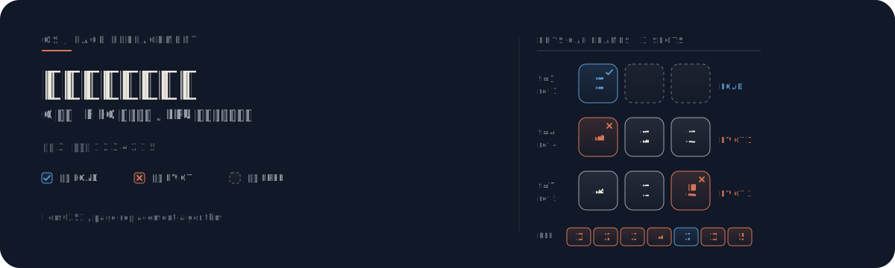

# 页面置换算法实验



用 C 语言实现 **FIFO（先进先出）** 与 **LRU（最近最久未使用）** 两种经典页面置换算法，含交互式对比模式与物理帧阵列可视化。

---

## 帧阵列步骤图

以引用串 `1 2 3 4 2 1 5`、内存帧数 `3` 为例，展示 FIFO 策略下物理帧的调入与淘汰过程：

| 步骤 | 引用 | 帧 1 | 帧 2 | 帧 3 | 动作 | 说明 |
|:----:|:----:|:----:|:----:|:----:|:----:|:-----|
| t=1 | 1 | **1** | — | — | 调入 | 空帧，直接装入 |
| t=2 | 2 | 1 | **2** | — | 调入 | 空帧，直接装入 |
| t=3 | 3 | 1 | 2 | **3** | 调入 | 空帧，直接装入 |
| t=4 | 4 | **4** ← 1 | 2 | 3 | 淘汰 1 | FIFO 队首页面 1 出队，页面 4 入队 |
| t=5 | 2 | 4 | 2 | 3 | 命中 | 页面 2 已在内存 |
| t=6 | 1 | 4 | **1** ← 2 | 3 | 淘汰 2 | FIFO 队首页面 2 出队，页面 1 入队 |
| t=7 | 5 | 4 | 1 | **5** ← 3 | 淘汰 3 | FIFO 队首页面 3 出队，页面 5 入队 |

**结果**：7 次引用中 6 次缺页、1 次命中。最终帧状态 `[4, 1, 5]`。

---

## 它是什么

一个操作系统课程实验项目，用纯 C 语言实现 FIFO 与 LRU 两种页面置换算法，支持单独运行或对比模式，直观展示不同淘汰策略对缺页率的影响。

---

## 为什么不同


### 机制差异

| | FIFO | LRU |
|:--|:-----|:----|
| **淘汰依据** | 页面进入内存的顺序 | 页面最近一次访问的时间 |
| **数据结构** | FIFO 队列 | 访问时间戳 |
| **关注点** | 驻留时长 | 访问局部性 |
| **理论假设** | 先进入的页面不再需要 | 最近未访问的页面近期不会访问 |

对于引用串 `1 2 3 4 2 1 5`、帧数 3，两种算法均产生 6 次缺页，但淘汰的页面不同：FIFO 按入队顺序淘汰 `1 → 2 → 3`，LRU 按访问时间淘汰 `1 → 3 → 4`。差异源于 t=5 对页面 2 的访问——LRU 据此更新时间戳避免了在 t=6 淘汰页面 2，而 FIFO 的队列不受访问行为影响。

### Belady 异常

FIFO 存在 **Belady 异常**：增加内存帧数反而可能导致缺页次数上升。经典示例——引用串 `1 2 3 4 1 2 5 1 2 3 4 5`：

| 帧数 | FIFO 缺页 | LRU 缺页 |
|:----:|:---------:|:---------:|
| 3 | 9 | 10 |
| 4 | **10** | 8 |

FIFO 从 3 帧增加到 4 帧时缺页数反而从 9 升至 10，而 LRU 帧数增加时缺页数单调下降。LRU 和 OPT 属于栈式算法，不存在 Belady 异常——这是它们在理论上的根本优势。

---

## 工作原理

### FIFO — 先进先出队列

```
  FIFO Queue   [1] → [2] → [3]
                          ↑
  淘汰队首 ← ─ ─ ─ ─ ─ ─  新页入队尾
```

- 维护一个 FIFO 队列，记录页面进入内存的顺序
- 缺页时淘汰队首页面，新页面入队尾
- 实现简单，但完全不考虑页面被访问后的行为

### LRU — 最近最久未使用

```
  Access Timestamp
  page 1   t=5   (most recent)
  page 2   t=2   ← 淘汰 (oldest)
  page 3   t=4
```

- 为每个内存页面维护最近访问时间戳
- 每次访问（含命中）更新该页时间戳
- 缺页时淘汰时间戳最小的页面

### 文件结构

```
page_replacement.h    公共头文件：帧表结构、算法接口声明
       │
       ├── fifo.c     FIFO 实现：队列 + front/rear 指针
       ├── lru.c      LRU 实现：帧表 + last_access[] 时间戳数组
       └── main.c     入口：交互输入 + 算法选择 + 结果输出
```

---

## 如何使用

### 编译

```bash
gcc *.c -o page_replacement.exe
```

### 运行

```bash
./page_replacement.exe
```

### 交互流程

1. 输入页面引用串长度
2. 输入引用串（空格分隔，如 `1 2 3 4 2 1 5`）
3. 输入内存帧数（如 `3`）
4. 选择算法：`1` = FIFO / `2` = LRU / `3` = 对比模式

### 示例输入

```
引用串长度: 7
引用串:     1 2 3 4 2 1 5
帧数:       3
算法:       3 (对比)
```

---

## 实验结果对比

引用串 `1 2 3 4 2 1 5`、帧数 3：

| 算法 | 缺页次数 | 缺页率 | 淘汰页面 | 最终帧状态 |
|:----:|:-------:|:------:|:--------:|:----------:|
| FIFO | 6 | 85.7% | 1 → 2 → 3 | [4, 1, 5] |
| LRU | 6 | 85.7% | 1 → 3 → 4 | [2, 1, 5] |

> 对于此短引用串，两者缺页率相同，但淘汰页面不同。LRU 的优势在具有强访问局部性的长引用串中更为显著。

---

## License

MIT
